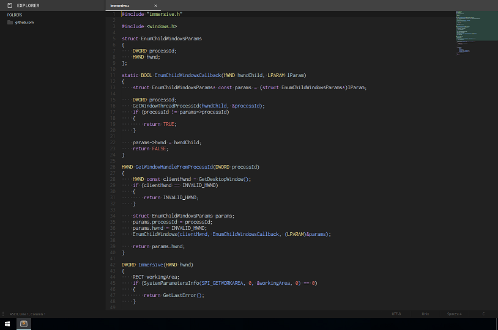

# immersive

[](LICENSE)

Windows で動作中のアプリケーションからタイトルバーを削除し、ウィンドウを最大化します。



## ビルド

```
build.bat
```

または、[リリースページからビルド済みバイナリを取得](https://github.com/manabedaiki/immersive/releases/download/release%2F1.0/immersive.exe)

## 使い方

アプリケーションを起動した状態で *immersive.exe* を実行します。

引数に対象アプリケーションのプロセスID `--pid` またはウィンドウハンドル `--hwnd` を指定する必要があります。

```
immersive.exe --pid 13344
immersive.exe --hwnd 2759824
```

以下の例では、事前に *cmd.exe* を起動した状態で、*cmd.exe* のウィンドウを最大化します。

```
# powershell
.\immersive.exe --pid (Get-Process -Name cmd)[0].Id
```
